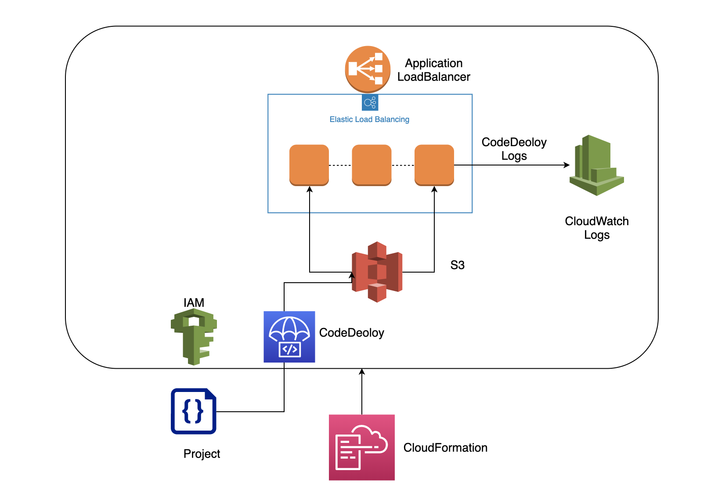

# IaC를 이용한 인프라 구성 / 자동 배포 / 배포 로그 수집
## CloudFormation 인프라 구성 / CodeDeploy 자동 배포 / CloudWatch 로그 수집

## 전제사항
* Nodejs 프로젝트 존재
   * 꼭 Nodejs일 필요는 없으나 Java Spring이나 Django로 바뀌게 될 경우 초기 설정이나 쉘 스크립트 수정이 필요
* CloudFormation을 사용할 수 있는 IAM 계정 존재
* CodeDeploy, CloudWatch Agent 설치된 AMI
    * AMI 없이 UserData로 설치 가능
* 빌드 파일을 실행하기 위한 요소(Node or Java)가 설치된 AMI 존재
    * AMI 없이 UserData로 설치 가능
* 프로젝트에 CodeDeploy 스펙을 정의한 appspec.yml 파일 존재

## 자동 배포 진행 과정

1. CloudFormation으로 LoadBalancer, Autoscaling Group, CodeDeploy 등 인프라 구성
2. 배포하고자 하는 프로젝트 빌드 파일을 S3로 전송
3. CodeDeploy를 사용하여 빌드된 프로젝트 파일 배포

# CloudFormation 인프라 구성

## json 또는 yaml 형식으로 인프라 정의
* ### Parameters
      * Parameters의 경우 프로젝트마다 다른 설정값이 필요하거나 입력이 필요한 변수에 대한 정의
      * 예를 들면 subnetId, keyName, autoscaingMaxSize/Minsize 같은 경우에는 사용자마다 다른 ID나 설정값이 필요
      * 각각 자신의 설정에 맞게 변경
```yaml
Parameters:
  KeyName:
    Type: String
    Default: dd
  WebappSubnets:
    Type: CommaDelimitedList
    Default: subnet-c44697bf, subnet-e8756180, subnet-e87f07a4
  ALBSubnets:
    Type: CommaDelimitedList
    Default: subnet-c44697bf, subnet-e8756180, subnet-e87f07a4
  MinSize:
    Type: Number
    Default: 2
  MaxSize:
    Type: Number
    Default: 3
  VPC:
    Type: String
    Default: vpc-aab1aac2
  AMIID:
    Type: String
    Default: ami-08ab3f7e72215fe91
  NamePrefix:
    AllowedPattern: '[a-zA-Z][a-zA-Z0-9]*'
    Default: bluegreen
    Description: Prefix for resource tags made by this template (2-15 chars).
    MaxLength: 15
    MinLength: 2
    Type: String
```
* ### Resource
    * Resouces에서는 인프라에 대한 세부사항 모두 정의 
      * VPC부터 시작해서 모든 인프라 세부 요소에 대해서 정의를 할 수 있고 기존에 있는 리소스를 가져와서 사용할 수도 있다.
* Role 설정
   * codedeploy가 loadbalancer와 autoscaling을 이용할 수 있도록 하는 설정
   * Instance가 cloudwatch와 codedeploy를 이용하고 s3로부터 코드를 가져올 수 있도록 하는 설정
```yaml
Resources:
  CodeDeployRole:
    Type: "AWS::IAM::Role"
    Properties:
      AssumeRolePolicyDocument:
        Version: "2012-10-17"
        Statement:
          -
            Effect: "Allow"
            Principal:
              Service:
                - "codedeploy.amazonaws.com"
            Action:
              - "sts:AssumeRole"
      Policies:
        -
          PolicyName: allow-autoscaling
          PolicyDocument:
            Version: "2012-10-17"
            Statement:
              -
                Effect: Allow
                Action:
                  - ec2:*
                  - autoscaling:*
                Resource: "*"
        -
          PolicyName: allow-loadbalance
          PolicyDocument:
            Version: "2012-10-17"
            Statement:
              -
                Effect: Allow
                Action:
                  - ec2:*
                  - autoscaling:*
                Resource: "*"
              -
                Effect: Allow
                Action:
                  - iam:CreateServiceLinkedRole
                Resource: "*"
              -
                Effect: Allow
                Action:
                  - elasticloadbalancing:*
                Resource: "*"
  WebappRole:
    Type: "AWS::IAM::Role"
    Properties:
      AssumeRolePolicyDocument:
        Version: "2012-10-17"
        Statement:
          -
            Effect: "Allow"
            Principal:
              Service:
                - "ec2.amazonaws.com"
                - "codedeploy.amazonaws.com"
                - "events.amazonaws.com"
            Action:
              - "sts:AssumeRole"
      Policies:
        -
          PolicyName: "allow-webapp-deployment-bucket-bucket"
          PolicyDocument:
            Version: "2012-10-17"
            Statement:
              -
                Effect: "Allow"
                Action: "s3:getObject"
                Resource: !Sub arn:aws:s3:::${WebappDeploymentBucket}/*
              -
                Effect: Allow
                Action:
                  - autoscaling:*
                  - cloudwatch:*
                  - logs:*
                  - sns:*
                Resource: "*"
```
* 실제 인프라 구성에 대한 정의
   * security Group
   * autoscaling group
   * loadbalancer 등등
```yaml
  WebappInstanceProfile:
    Type: "AWS::IAM::InstanceProfile"
    Properties:
      Roles:
        - Ref: WebappRole
  ALBSecurityGroup:
    Type: AWS::EC2::SecurityGroup
    Properties:
      GroupDescription: allow access to ALB from internet
      VpcId:
        Ref: VPC
      SecurityGroupIngress:
      - IpProtocol: tcp
        FromPort: '80'
        ToPort: '80'
        CidrIp: 0.0.0.0/0
  WebappSecurityGroup:
    Type: AWS::EC2::SecurityGroup
    Properties:
      GroupDescription: allow access to Webapp from ALB
      VpcId:
        Ref: VPC
      SecurityGroupIngress:
      - IpProtocol: tcp
        FromPort: '3000'
        ToPort: '3000'
        SourceSecurityGroupId:
          Ref: ALBSecurityGroup
      - IpProtocol: tcp
        FromPort: '22'
        ToPort: '22'
        CidrIp: 0.0.0.0/0
  WebappLaunchConfig:
    Type: AWS::AutoScaling::LaunchConfiguration
    Properties:
      AssociatePublicIpAddress: true
      ImageId:
        Ref: AMIID
      InstanceType: t2.micro
      KeyName:
        Ref: KeyName
      SecurityGroups:
        - Ref: WebappSecurityGroup
      IamInstanceProfile:
        Ref: WebappInstanceProfile
      UserData:
        Fn::Base64:
          !Sub |
            #! /bin/bash -xe
            # update yum just in case
            yum update -y
            # install codedeploy agent
            yum install -y ruby
            yum install -y wget
            cd /home/ec2-user
            # you have to notice region in url
            curl -O https://aws-codedeploy-ap-northeast-2.s3.amazonaws.com/latest/install
            chmod +x ./install
            ./install auto
            # install cloudwatch logs agent 
            sudo yum install -y awslogs
            # set config file sending log to right region
            echo -e "[general]\ndatetime_format = %Y-%m-%d %H:%M:%S\nfile = /var/log/aws/codedeploy-agent/codedeploy-agent.log\nlog_stream_name = {instance_id}-codedeploy-agent-log\nlog_group_name = codedeploy-agent-log\n\n[codedeploy-agent-logs]\ndatetime_format = %Y-%m-%d %H:%M:%S\nfile = /var/log/aws/codedeploy-agent/codedeploy-agent.log\nlog_stream_name = {instance_id}-codedeploy-agent-log\nlog_group_name = codedeploy-agent-log\n\n[codedeploy-updater-logs]\nfile = /tmp/codedeploy-agent.update.log\nlog_stream_name = {instance_id}-codedeploy-updater-log\nlog_group_name = codedeploy-updater-log\n\n[codedeploy-deployment-logs]\nfile = /opt/codedeploy-agent/deployment-root/deployment-logs/codedeploy-agent-deployments.log\nlog_stream_name = {instance_id}-codedeploy-deployments-log\nlog_group_name = codedeploy-deployments-log" > codedeploy_logs.conf
            echo -e "[plugins]\ncwlogs = cwlogs\n[default]\nregion = ap-northeast-2" > codedeploy_cli.conf
            sudo cp ./codedeploy_logs.conf /etc/awslogs/awslogs.conf
            sudo cp ./codedeploy_cli.conf /etc/awslogs/awscli.conf
            # start cloudwatch agent
            sudo systemctl start awslogsd
            # get node into yum
            curl --silent --location https://rpm.nodesource.com/setup_6.x | bash -
            # install node and npm in one line
            yum install -y nodejs
            # install pm2 to restart node app
            npm i -g pm2@2.4.3
  AutoScalingGroup:
    Type: AWS::AutoScaling::AutoScalingGroup
    Properties:
      HealthCheckType: ELB
      HealthCheckGracePeriod: 300
      MinSize:
        Ref: MinSize
      MaxSize:
        Ref: MaxSize
      LaunchConfigurationName:
        Ref: WebappLaunchConfig
      VPCZoneIdentifier:
        Ref: WebappSubnets
      TargetGroupARNs:
        - Ref: ALBTargetGroup
      Tags:
        - Key: Name
          Value: webapp-example
          PropagateAtLaunch: true
  ALBListener:
    Type: AWS::ElasticLoadBalancingV2::Listener
    Properties:
      DefaultActions:
        -
          Type: forward
          TargetGroupArn:
            Ref: ALBTargetGroup
      LoadBalancerArn:
        Ref: LoadBalancer
      Port: 80
      Protocol: HTTP
  LoadBalancer:
    Type: AWS::ElasticLoadBalancingV2::LoadBalancer
    Properties:
      Name: testLoadbalancer
      Scheme: internet-facing
      Subnets:
        Ref: ALBSubnets
      SecurityGroups:
        - Ref: ALBSecurityGroup
      Tags:
      - Key: Name
        Value:
          !Join ["", [ Ref: NamePrefix, "-elb"] ]
  ALBTargetGroup:
    Type: AWS::ElasticLoadBalancingV2::TargetGroup
    Properties:
      TargetGroupAttributes:
        - Key: deregistration_delay.timeout_seconds
          Value: 30
      HealthCheckIntervalSeconds: 30
      UnhealthyThresholdCount: 2
      HealthyThresholdCount: 2
      HealthCheckPath: /
      Port: 3000
      Protocol: HTTP
      VpcId:
        Ref: VPC
```
* codedeploy 설정
    * codedeploy application을 설정
    * codedeploy group을 이용하여 세부 배포 설정
```yaml
  WebappApplication:
    Type: "AWS::CodeDeploy::Application"
    Properties:
      ApplicationName: testApp
  WebappDeploymentGroup:
    Type: "AWS::CodeDeploy::DeploymentGroup"
    Properties:
      DeploymentGroupName: test-group
      ApplicationName: !Ref WebappApplication
      ServiceRoleArn: !GetAtt CodeDeployRole.Arn
      DeploymentConfigName: CodeDeployDefault.OneAtATime
      DeploymentStyle:
        DeploymentType: IN_PLACE
        DeploymentOption: WITH_TRAFFIC_CONTROL
      LoadBalancerInfo:
        TargetGroupInfoList:
          - Name: !GetAtt ALBTargetGroup.TargetGroupName
      AutoScalingGroups:
      - Ref: AutoScalingGroup
  WebappDeploymentBucket:
    Type: "AWS::S3::Bucket"
    Properties:
      BucketName: 'testtest11324'
```
* ### output
    * loadbalancer dns와 같이 인프라 생성이후에 정의되는 변수들을 출력하여 굳이 콘솔에서 로드밸런서 주소를 확인하지 않아도 된다
```yaml
Outputs:
  WebappUrl:
    Description: Webapp URL
    Value: !GetAtt LoadBalancer.DNSName
  DeploymentGroup:
    Description: Webapp Deployment Group
    Value: !Ref WebappDeploymentGroup
  DeploymentBucket:
    Description: Deployment bucket
    Value: !Ref WebappDeploymentBucket
  ApplicationName:
    Description: CodeDeploy Application name
    Value: !Ref WebappApplication
```
* ### Cloudformation 스택 생성
```
$ aws cloudformation create-stack --stack-name test-template-1 --template-body file:///Users/huhjin-ho/Desktop/cloudformation/codedeploy/code_deploy.yaml --capabilities CAPABILITY_IAM
```
* ### Cloudformation 스택 업데이트
    * 변경하고 싶은 인프라가 있을 경우 콘솔에서 수정하는 것이 아니라 코드에서 수정해야 한다.
        * 콘솔에서 임의로 수정할 시 다시 스택을 생성하거나 삭제할 때 오류 발생
```
$ aws cloudformation update-stack --stack-name test-template-1 --template-body file:///Users/huhjin-ho/Desktop/IaC/cloudformation/codedeploy/code_deploy.yaml --capabilities CAPABILITY_IAM
```
* ### Cloudformation 스택 삭제
```
$ aws cloudformation delete-stack --stack-name test-template-1
```

# 빌드 파일 S3 전송
```
aws deploy push --application-name testApp --s3-location  s3://testtest11324/test-4.zip --source webapp
```

# 빌드된 파일 배포

## 배포 방식 종류
* ### In Place 방식
    * 기존에 존재하는 인스턴스에 배포하는 방식
* ### Blue / Green 방식
    * 기존에 존재하는 인스턴스는 그대로 두고 새로운 autoscaling group에 배포 후 정상 배포시 교체하는 방식

## LoadBalancer로 트래픽 분배
* 배포하는 동안 오류가 발생할 수 있으므로 Loadbalancer를 이용하여 배포 도중에 트래픽 자동 관리

## appspec.yml 설정
```
version: 0.0
os: linux
files:
  - source: src
    destination: /opt/webapp
  - source: node_modules
    destination: /opt/webapp/node_modules
hooks:
  ApplicationStop:
    - location: deployment_scripts/stop.sh
      timeout: 180
  AfterInstall:
    - location: deployment_scripts/deploy.sh
      timeout: 180
  ApplicationStart:
    - location: deployment_scripts/start.sh
      timeout: 180

```
* ### start.sh
   * 빌드된 프로젝트를 실행하는 스크립트로 현재는 Node를 기준으로 작성되어 있음
   * 각각 자신의 빌드된 프로젝트를 실행하는 코드로 바꿔주면 똑같이 적용 가능
```
#!/usr/bin/env bash

sudo pm2 stop node-app
# actually start the server
sudo pm2 start /opt/webapp/index.js -i 0 --name "node-app"
```
* ### stop.sh
   * 빌드된 프로젝트를 중지하는 스크립트로 현재는 Node를 기준으로 작성되어 있음
   * 각각 자신의 빌드된 프로젝트를 중지하는 코드로 바꿔주면 똑같이 적용 가능
```
#!/usr/bin/env bash

sudo pm2 stop node-app
sleep 10
```

## 명령어
```
aws deploy create-deployment --application-name testApp  --s3-location bucket="testtest11324",key="test-4.zip",bundleType=zip --deployment-group-name test-group
```

# 배포 관련 로그 확인

## UserData
* UserData 설정
   * Autoscaling Instance 생성시 자동 실행되는 스크립트
   * 현재 CloudFormation 정의 파일에 사용됨 - code_deploy.yaml
   * cloudwatch를 실행하는 코드 아래로는 Node 기준으로 작성되어 있음
   * Node 관련 코드 아래로는 자신의 프로젝트 실행을 위한 Dependcies 설치 코드로 바꿔주면 똑같이 적용 가능
   * 예를 들어 빌드 파일이 jar 형식인 경우에는 맞는 버젼의 java를 설치
* AMI
   * userdata를 사용하지 않고 스크립트 내용을 직접 인스턴스의 실행하여 AMI로 빌드하여 사용 가능
   * 위와 같은 경우에는 대신 autoscaling에 사용되는 AMI ID를 자신이 만든 AMI를 사용해야 함
* 스크립트 내용
   * codedeploy, cloudwathch logs agent 설치(필수)
   * cloudwatch 설정 파일 생성(필수)
   * dependcies 설치(상황에 따른 설치 필요)
   * pm2 설치(노드 시작/중단 사용하기 위함)(상황에 따른 설치 필요)
```yaml
UserData:
        Fn::Base64:
          !Sub |
            #! /bin/bash -xe
            # update yum just in case
            yum update -y
            # install codedeploy agent
            yum install -y ruby
            yum install -y wget
            cd /home/ec2-user
            # you have to notice region in url
            curl -O https://aws-codedeploy-ap-northeast-2.s3.amazonaws.com/latest/install
            chmod +x ./install
            ./install auto
            # install cloudwatch logs agent 
            sudo yum install -y awslogs
            # set config file sending log to right region
            echo -e "[general]\ndatetime_format = %Y-%m-%d %H:%M:%S\nfile = /var/log/aws/codedeploy-agent/codedeploy-agent.log\nlog_stream_name = {instance_id}-codedeploy-agent-log\nlog_group_name = codedeploy-agent-log\n\n[codedeploy-agent-logs]\ndatetime_format = %Y-%m-%d %H:%M:%S\nfile = /var/log/aws/codedeploy-agent/codedeploy-agent.log\nlog_stream_name = {instance_id}-codedeploy-agent-log\nlog_group_name = codedeploy-agent-log\n\n[codedeploy-updater-logs]\nfile = /tmp/codedeploy-agent.update.log\nlog_stream_name = {instance_id}-codedeploy-updater-log\nlog_group_name = codedeploy-updater-log\n\n[codedeploy-deployment-logs]\nfile = /opt/codedeploy-agent/deployment-root/deployment-logs/codedeploy-agent-deployments.log\nlog_stream_name = {instance_id}-codedeploy-deployments-log\nlog_group_name = codedeploy-deployments-log" > codedeploy_logs.conf
            echo -e "[plugins]\ncwlogs = cwlogs\n[default]\nregion = ap-northeast-2" > codedeploy_cli.conf
            sudo cp ./codedeploy_logs.conf /etc/awslogs/awslogs.conf
            sudo cp ./codedeploy_cli.conf /etc/awslogs/awscli.conf
            # start cloudwatch agent
            sudo systemctl start awslogsd
            ################### Node Dependcies ###############################
            curl --silent --location https://rpm.nodesource.com/setup_6.x | bash -
            # install node and npm in one line
            yum install -y nodejs
            # install pm2 to restart node app
            npm i -g pm2@2.4.3
            ###################################################################
```
## CloudWatch 로그 설정
   * cloudwatch에 로그를 남기기 위한 설정 파일들
   * awscli.conf, awslogs.conf 두 개로 구성
   * awscli.conf
      * region이나 plugin 정의
   * awslogs.conf
      * 로그로 남기고 싶은 파일에 대한 정의
      * application 로그도 가능
```
#/etc/awslogs/awscli.conf

[plugins]
cwlogs = cwlogs       ## plugin 지정
[default]      
region = ap-northeast-2    ## cloudwatch region 지정
```

```
#/etc/awslogs/awslogs.conf

[general]       ## general 없을 시 오류 발생
datetime_format = %Y-%m-%d %H:%M:%S
file = /var/log/aws/codedeploy-agent/codedeploy-agent.log
log_stream_name = {instance_id}-codedeploy-agent-log
log_group_name = codedeploy-agent-log

[codedeploy-agent-logs]
datetime_format = %Y-%m-%d %H:%M:%S
file = /var/log/aws/codedeploy-agent/codedeploy-agent.log
log_stream_name = {instance_id}-codedeploy-agent-log
log_group_name = codedeploy-agent-log

[codedeploy-updater-logs]
file = /tmp/codedeploy-agent.update.log
log_stream_name = {instance_id}-codedeploy-updater-log
log_group_name = codedeploy-updater-log

[codedeploy-deployment-logs]
file = /opt/codedeploy-agent/deployment-root/deployment-logs/codedeploy-agent-deployments.log
log_stream_name = {instance_id}-codedeploy-deployments-log
log_group_name = codedeploy-deployments-log
```

* ### CloudWatch가 제대로 작동 안할 시 확인을 위한 로그 위치
```
/var/log/awslogs.log
```
